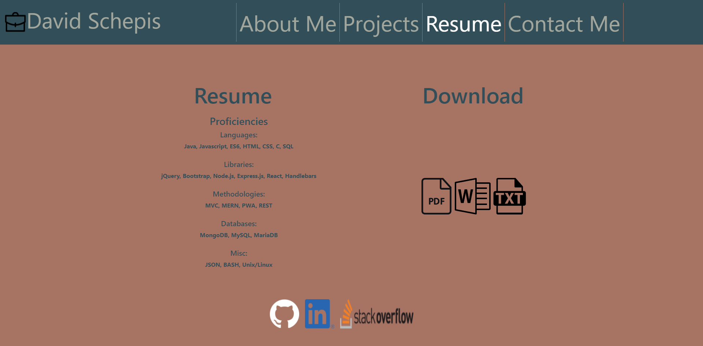

# Portfolio_React

## Description
Personal Portfolio powered by React

## Table of Contents

- [Links](#links)
- [Example](#example)
- [Installation](#installation)
- [Usage](#usage)
- [License](#license)
- [Contributing](#contributing)
- [Tests](#tests)
- [Questions](#questions)

 ## Links
https://github.com/davidschepis/Portfolio_React

https://davidschepis.github.io/Portfolio_React/

 ## Example


 ## Installation
To install necessary dependencies, run the following command:

```
npm i
```

 ## Usage
Please do not use this repo

 ## License
This project is not licensed

 ## Contributing
Unfortunately, there is no contributing to this repo

 ## Tests
To run tests, run the following command:

```
There are currently no tests
```

 ## Questions
Please contact me at [davids.developer@outlook.com](mailto:davids.developer@outlook.com) with any questions.
Github Repo: [davidschepis](https://github.com/davidschepis).
